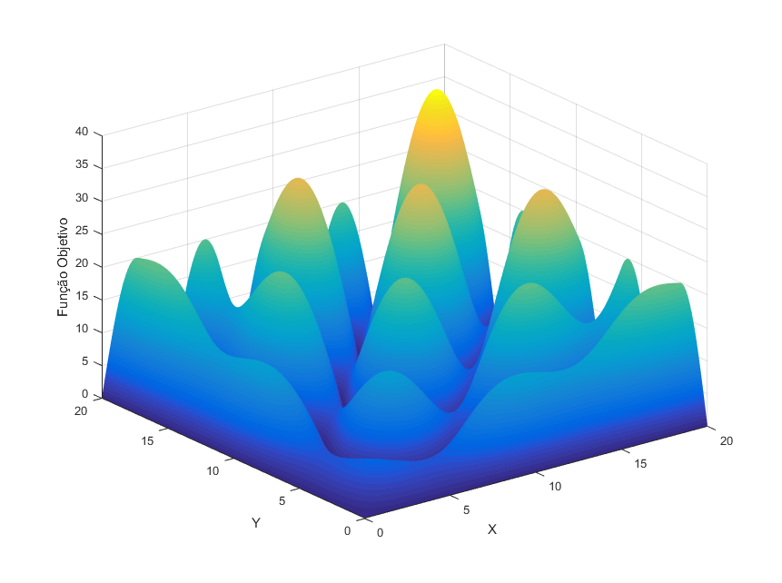
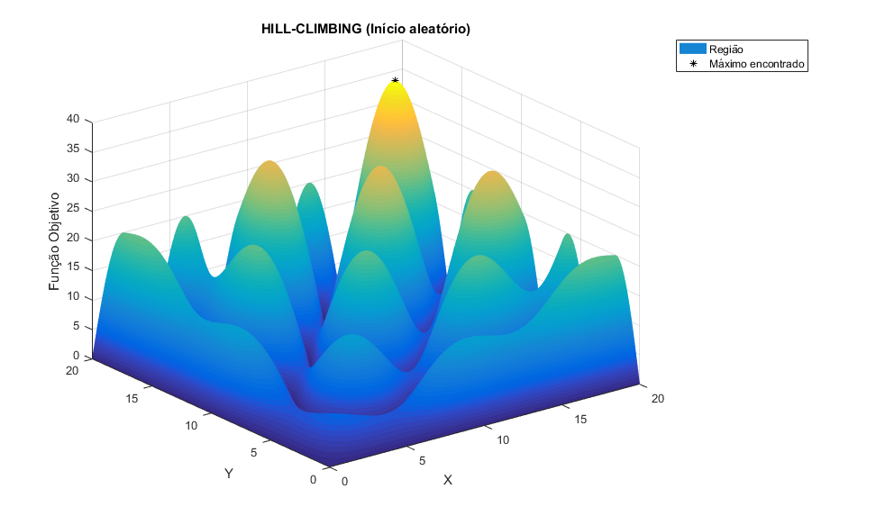

# Hill-Climbing
> O objetivo é encontrar o máximo da função f(x,y) = |xsen(ypi/4) + ysen(xp/4)|
por meio do algoritmo hill-climbing. 

**_Descrição:_**

Com as variáveis x e y pertencentes ao intervalo entre 0 e 20. Os vizinhos de determinado
estado (x, y) são (x+-0.01 ; y+-0.01):

**_Implementação:_**

Na implementação fora criados os valores das variáveis de x e y dentro do intervalo
de 0 e 20 (com passo de 0.01). E com tais fora calculado o valor da equação (1.1) para cada
ponto (x,y). A região englobada pelo problema pode ser vista na Figura:

O algoritmo fora implementado de modo a iniciar com um ponto (x,y) gerado
randomicamente. Logo, poderá ocorrer de o mesmo se deparar apenas com um máximo local.
Como forma de conferir se o algoritmo encontrou o ponto máximo para a FO, fora armazenados
todos os pontos ’considerados’ na execução e calculado o valor máximo que estes agregam a
equação da FO.

Ao concluir todas as instruções, a implementação retorna (na janela de comandos do
MATLAB) qual o ponto inicial, o ponto máximo encontrado, seus respectivos valores quando
aplicados na FO e a representação gráfica. A Figura a seguir ilustra o ponto máximo encontrado pelo
algoritmo.

Inúmeros testes foram realizados a fim de analisar a solução, sendo notório em tal a
’dependência’ do resultado quanto à natureza randômica do ponto inicial. Encontrando portanto,
algumas vezes, apenas máximos locais e não o máximo global de f(x,y) (Máximo de aproximadamente 36.08).

